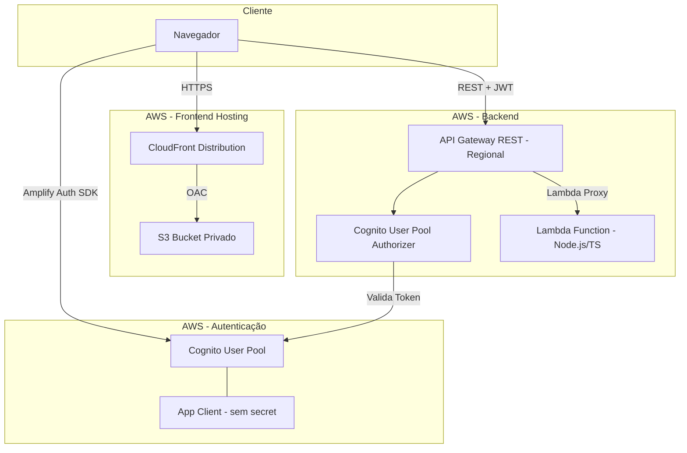
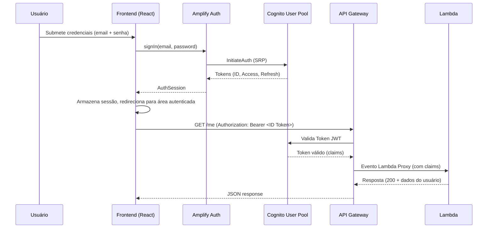
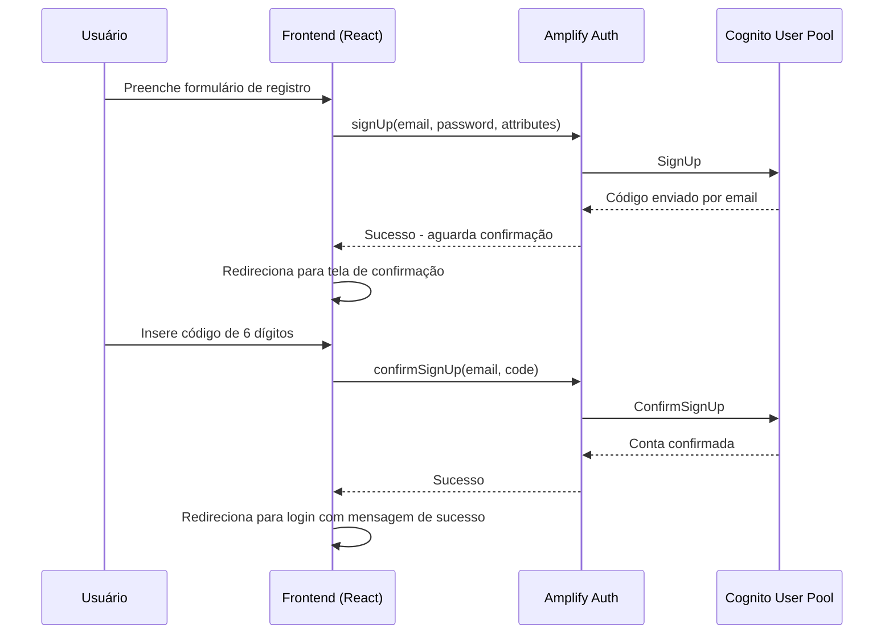
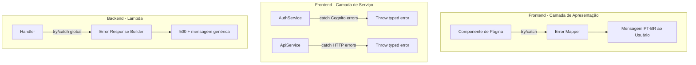

# Design Document

## Overview

Este documento descreve o design técnico para a aplicação web com login customizado utilizando Amazon Cognito. A solução é composta por um frontend React + TypeScript (Vite), um backend serverless com API Gateway REST API e Lambda (Node.js + TypeScript), autenticação via Cognito User Pool com telas customizadas (sem Hosted UI), e hospedagem estática via S3 privado com CloudFront.

### Decisões de Design

| Decisão | Escolha | Justificativa |
|---------|---------|---------------|
| Framework Frontend | React 18 + TypeScript + Vite | Performance de build, tipagem estática, ecossistema maduro |
| Autenticação | AWS Amplify Auth (v6) | Abstração oficial para Cognito, gerenciamento automático de tokens |
| Roteamento | React Router v6 | Padrão de mercado, suporte a rotas protegidas e lazy loading |
| Estado de autenticação | React Context + useReducer | Simples, sem dependência externa, suficiente para estado global de auth |
| Estilização | CSS Modules | Escopo local, sem runtime overhead, compatível com Vite |
| Backend | Lambda única (monolítica) | Simplicidade para 3 endpoints, cold start compartilhado |
| API | API Gateway REST (Regional) | Suporte nativo a Cognito Authorizer, deploy por stages |
| Hosting | S3 privado + CloudFront + OAC | Segurança (sem acesso público direto), HTTPS, performance global |

## Architecture

### Diagrama de Arquitetura de Alto Nível



### Fluxo de Autenticação



### Fluxo de Registro e Confirmação



## Components and Interfaces

### Frontend - Estrutura de Componentes

```
src/
├── components/
│   ├── LoadingSpinner/
│   │   └── LoadingSpinner.tsx          # Indicador de carregamento reutilizável
│   ├── PasswordInput/
│   │   └── PasswordInput.tsx           # Input com toggle de visibilidade
│   ├── PrivateRoute/
│   │   └── PrivateRoute.tsx            # Wrapper para rotas protegidas
│   ├── PublicRoute/
│   │   └── PublicRoute.tsx             # Redireciona autenticados para área privada
│   └── ErrorMessage/
│       └── ErrorMessage.tsx            # Exibição padronizada de erros
├── pages/
│   ├── HomePage/
│   │   └── HomePage.tsx                # Página inicial (tema dinossauro)
│   ├── LoginPage/
│   │   └── LoginPage.tsx               # Tela de login
│   ├── RegisterPage/
│   │   └── RegisterPage.tsx            # Tela de registro
│   ├── ConfirmEmailPage/
│   │   └── ConfirmEmailPage.tsx        # Tela de confirmação de código
│   ├── ForgotPasswordPage/
│   │   └── ForgotPasswordPage.tsx      # Tela de recuperação de senha
│   ├── DashboardPage/
│   │   └── DashboardPage.tsx           # Área autenticada principal
│   └── ProfilePage/
│       └── ProfilePage.tsx             # Tela de perfil do usuário
├── routes/
│   └── AppRouter.tsx                   # Configuração de rotas
├── services/
│   ├── authService.ts                  # Wrapper sobre Amplify Auth
│   └── apiService.ts                   # Cliente HTTP para API Gateway
├── contexts/
│   └── AuthContext.tsx                 # Context + Provider de autenticação
├── hooks/
│   ├── useAuth.ts                      # Hook para consumir AuthContext
│   └── useForm.ts                      # Hook genérico de formulário com validação
├── utils/
│   ├── validators.ts                   # Funções de validação (email, senha, etc.)
│   └── errorMapper.ts                  # Mapeamento de erros Cognito → mensagens PT-BR
├── styles/
│   └── global.css                      # Estilos globais e variáveis CSS
├── assets/
│   └── ...                             # Imagens e assets do tema dinossauro
├── App.tsx                             # Componente raiz
├── main.tsx                            # Entry point (configura Amplify)
└── vite-env.d.ts                       # Tipos para variáveis de ambiente Vite
```

### Interfaces dos Componentes Principais

#### AuthContext

```typescript
interface AuthState {
  isAuthenticated: boolean;
  isLoading: boolean;
  user: UserProfile | null;
}

interface UserProfile {
  userId: string;       // sub do Cognito
  email: string;
  name: string;
  preferredUsername: string;  // apelido
  emailVerified: boolean;
}

interface AuthContextValue extends AuthState {
  login: (email: string, password: string) => Promise<LoginResult>;
  register: (data: RegisterData) => Promise<void>;
  confirmEmail: (email: string, code: string) => Promise<void>;
  resendConfirmationCode: (email: string) => Promise<void>;
  forgotPassword: (email: string) => Promise<void>;
  resetPassword: (email: string, code: string, newPassword: string) => Promise<void>;
  changePassword: (oldPassword: string, newPassword: string) => Promise<void>;
  updateProfile: (attributes: Partial<ProfileAttributes>) => Promise<void>;
  logout: () => Promise<void>;
  refreshUser: () => Promise<void>;
}

type LoginResult = 
  | { status: 'success' }
  | { status: 'confirmSignUp'; email: string };

interface RegisterData {
  email: string;
  password: string;
  name: string;
  preferredUsername: string;
}

interface ProfileAttributes {
  name: string;
  preferredUsername: string;
}
```

#### AuthService (Wrapper sobre Amplify Auth)

```typescript
// services/authService.ts
interface AuthService {
  signIn(email: string, password: string): Promise<SignInOutput>;
  signUp(data: RegisterData): Promise<SignUpOutput>;
  confirmSignUp(email: string, code: string): Promise<void>;
  resendSignUpCode(email: string): Promise<void>;
  resetPassword(email: string): Promise<void>;
  confirmResetPassword(email: string, code: string, newPassword: string): Promise<void>;
  changePassword(oldPassword: string, newPassword: string): Promise<void>;
  updateUserAttributes(attributes: Record<string, string>): Promise<void>;
  getCurrentUser(): Promise<UserProfile | null>;
  signOut(): Promise<void>;
  getIdToken(): Promise<string | null>;
}
```

#### ApiService (Cliente HTTP)

```typescript
// services/apiService.ts
interface ApiService {
  get<T>(path: string): Promise<ApiResponse<T>>;
}

interface ApiResponse<T> {
  data: T;
  status: number;
}

interface ApiConfig {
  baseUrl: string;
  timeout: number;  // 10000ms
  getToken: () => Promise<string | null>;
}
```

#### Validators

```typescript
// utils/validators.ts
interface ValidationResult {
  isValid: boolean;
  errorMessage: string | null;  // Mensagem em PT-BR
}

function validateEmail(email: string): ValidationResult;
function validatePassword(password: string): ValidationResult;
function validatePasswordMatch(password: string, confirmation: string): ValidationResult;
function validateName(name: string): ValidationResult;
function validatePreferredUsername(username: string): ValidationResult;
function validateConfirmationCode(code: string): ValidationResult;
```

#### Error Mapper

```typescript
// utils/errorMapper.ts
type CognitoErrorCode =
  | 'NotAuthorizedException'
  | 'UserNotFoundException'
  | 'UsernameExistsException'
  | 'CodeMismatchException'
  | 'ExpiredCodeException'
  | 'InvalidPasswordException'
  | 'LimitExceededException'
  | 'UserNotConfirmedException';

function mapCognitoError(errorCode: string): string;  // Retorna mensagem em PT-BR
function mapApiError(status: number): string;          // Retorna mensagem em PT-BR
```

### Backend - Estrutura

```
backend/
├── src/
│   ├── index.ts                # Handler principal (roteamento)
│   ├── routes/
│   │   ├── health.ts           # GET /health
│   │   ├── me.ts               # GET /me
│   │   └── gameStatus.ts       # GET /game/status
│   ├── utils/
│   │   ├── cors.ts             # Utilitário CORS
│   │   └── response.ts         # Helper para respostas Lambda Proxy
│   └── types/
│       └── index.ts            # Tipos compartilhados
├── package.json
├── tsconfig.json
└── README.md
```

#### Lambda Handler Interface

```typescript
// backend/src/index.ts
import { APIGatewayProxyEvent, APIGatewayProxyResult } from 'aws-lambda';

export const handler = async (
  event: APIGatewayProxyEvent
): Promise<APIGatewayProxyResult> => {
  // Roteamento baseado em httpMethod + path
};
```

#### Response Helper

```typescript
// backend/src/utils/response.ts
interface LambdaResponse {
  statusCode: number;
  headers: Record<string, string>;
  body: string;
}

function buildResponse(statusCode: number, body: object, origin?: string): LambdaResponse;
function buildErrorResponse(statusCode: number, message: string, origin?: string): LambdaResponse;
```

#### CORS Utility

```typescript
// backend/src/utils/cors.ts
const ALLOWED_ORIGINS: string[] = [
  'http://localhost:5173',
  // CloudFront URL adicionada via variável de ambiente
  // Domínio customizado (se configurado) via variável de ambiente
];

function getCorsHeaders(requestOrigin: string | undefined): Record<string, string>;
function isOriginAllowed(origin: string | undefined): boolean;
```

### Componente PrivateRoute

```typescript
// components/PrivateRoute/PrivateRoute.tsx
interface PrivateRouteProps {
  children: React.ReactNode;
}

// Verifica isAuthenticated do AuthContext
// Se isLoading → renderiza LoadingSpinner
// Se !isAuthenticated → redireciona para /login
// Se isAuthenticated → renderiza children
```

### Componente PublicRoute

```typescript
// components/PublicRoute/PublicRoute.tsx
interface PublicRouteProps {
  children: React.ReactNode;
}

// Se isAuthenticated → redireciona para /dashboard
// Caso contrário → renderiza children
```

## Data Models

### Cognito User Pool - Atributos do Usuário

| Atributo | Tipo | Obrigatório | Descrição |
|----------|------|-------------|-----------|
| sub | UUID | Automático | Identificador único do usuário (gerado pelo Cognito) |
| email | String (max 254) | Sim | Email do usuário, usado como alias de login |
| email_verified | Boolean | Automático | Indica se o email foi verificado |
| name | String (max 128) | Sim | Nome completo do usuário |
| preferred_username | String (max 64) | Sim | Apelido do usuário |

### Configuração do Cognito User Pool

```yaml
UserPool:
  Region: us-east-1
  SignInAliases: [email]
  AutoVerifiedAttributes: [email]
  SelfSignUp: enabled
  VerificationMethod: code (email)
  PasswordPolicy:
    MinimumLength: 8
    RequireUppercase: true
    RequireLowercase: true
    RequireNumbers: true
    RequireSymbols: true
  AppClient:
    GenerateSecret: false
    AuthFlows:
      - ALLOW_USER_SRP_AUTH
      - ALLOW_REFRESH_TOKEN_AUTH
```

### API Endpoints - Contratos

#### GET /health (Público)

**Request:** Sem body, sem Authorization header.

**Response (200):**
```json
{
  "status": "ok",
  "message": "API funcionando corretamente"
}
```

#### GET /me (Protegido - Cognito Authorizer)

**Request Headers:**
```
Authorization: Bearer <ID_TOKEN>
```

**Response (200):**
```json
{
  "autenticado": true,
  "usuarioId": "a1b2c3d4-e5f6-7890-abcd-ef1234567890",
  "email": "usuario@exemplo.com",
  "nome": "João Silva",
  "apelido": "joaosilva"
}
```

**Response (401) - Claims não extraídos:**
```json
{
  "message": "Não foi possível identificar o usuário"
}
```

#### GET /game/status (Protegido - Cognito Authorizer)

**Request Headers:**
```
Authorization: Bearer <ID_TOKEN>
```

**Response (200):**
```json
{
  "message": "O jogo será disponibilizado no Projeto 2"
}
```

#### Respostas de Erro Padrão

**401 - Não autorizado (Cognito Authorizer):**
```json
{
  "message": "Unauthorized"
}
```

**404 - Rota não encontrada:**
```json
{
  "message": "Rota não encontrada"
}
```

**500 - Erro interno:**
```json
{
  "message": "Erro interno do servidor"
}
```

### Configuração do Frontend (Amplify)

```typescript
// main.tsx - Configuração do Amplify Auth
import { Amplify } from 'aws-amplify';

Amplify.configure({
  Auth: {
    Cognito: {
      userPoolId: import.meta.env.VITE_COGNITO_USER_POOL_ID,
      userPoolClientId: import.meta.env.VITE_COGNITO_USER_POOL_CLIENT_ID,
    }
  }
});
```

### Variáveis de Ambiente

#### Frontend (.env)
```
VITE_AWS_REGION=us-east-1
VITE_COGNITO_USER_POOL_ID=us-east-1_XXXXXXXXX
VITE_COGNITO_USER_POOL_CLIENT_ID=xxxxxxxxxxxxxxxxxxxxxxxxxx
VITE_API_URL=https://xxxxxxxxxx.execute-api.us-east-1.amazonaws.com/dev
```

#### Lambda (Environment Variables)
```
ALLOWED_ORIGINS=http://localhost:5173,https://xxxxxxxxxx.cloudfront.net
```

### Mapeamento de Rotas (Frontend)

| Rota | Página | Tipo | Descrição |
|------|--------|------|-----------|
| `/` | HomePage | Pública | Página inicial com tema dinossauro |
| `/login` | LoginPage | Pública (redireciona se autenticado) | Tela de login |
| `/register` | RegisterPage | Pública (redireciona se autenticado) | Tela de registro |
| `/confirm-email` | ConfirmEmailPage | Pública | Confirmação de código |
| `/forgot-password` | ForgotPasswordPage | Pública (redireciona se autenticado) | Recuperação de senha |
| `/dashboard` | DashboardPage | Privada | Área autenticada |
| `/profile` | ProfilePage | Privada | Perfil do usuário |


## Correctness Properties

*A property is a characteristic or behavior that should hold true across all valid executions of a system — essentially, a formal statement about what the system should do. Properties serve as the bridge between human-readable specifications and machine-verifiable correctness guarantees.*

### Property 1: Email Validation Correctness

*For any* string input, the `validateEmail` function SHALL return `isValid: true` if and only if the input matches a valid email format (contains exactly one `@`, has non-empty local and domain parts with valid characters, and domain contains at least one `.`), and SHALL return `isValid: false` with a non-empty PT-BR error message for any string that does not match a valid email format.

**Validates: Requirements 2.5, 3.8**

### Property 2: Password Match Validation

*For any* two strings `password` and `confirmation`, the `validatePasswordMatch` function SHALL return `isValid: true` if and only if the two strings are exactly equal (byte-for-byte), and SHALL return `isValid: false` with a PT-BR message indicating mismatch for any pair of strings that differ.

**Validates: Requirements 3.4, 5.8**

### Property 3: Password Complexity Validation

*For any* string input, the `validatePassword` function SHALL return `isValid: true` if and only if the input has at least 8 characters AND contains at least one uppercase letter AND at least one lowercase letter AND at least one digit AND at least one special character. For any input that fails one or more requirements, it SHALL return `isValid: false` with a PT-BR message describing the unmet requirements.

**Validates: Requirements 3.5, 5.7, 17.7**

### Property 4: Field Length Validation

*For any* string input and field specification (field name, max length), the field validator SHALL return `isValid: true` if the input is non-empty (after trimming) and its length is ≤ the specified maximum, and SHALL return `isValid: false` with a PT-BR error message if the input is empty, whitespace-only, or exceeds the maximum length. Specifically: `validateName` uses max 128 characters, `validatePreferredUsername` uses max 64 characters.

**Validates: Requirements 7.3, 7.5**

### Property 5: Private Route Access Control

*For any* route configured as a private route and any authentication state, the `PrivateRoute` component SHALL render its children if and only if the user is authenticated (`isAuthenticated === true`), and SHALL redirect to `/login` for any unauthenticated user (`isAuthenticated === false` and `isLoading === false`).

**Validates: Requirements 8.1, 8.2**

### Property 6: Public Route Redirect for Authenticated Users

*For any* route configured as a public authentication route (login, register, forgot-password) and an authenticated user, the `PublicRoute` component SHALL redirect to `/dashboard` instead of rendering the page content.

**Validates: Requirements 8.6**

### Property 7: Lambda Claim Extraction and Mapping

*For any* valid set of Cognito claims (sub, email, name, preferred_username) present in a Lambda Proxy event's `requestContext.authorizer.claims`, when the Lambda handler processes GET /me, it SHALL return a response with status 200 and a JSON body where `usuarioId` equals the `sub` claim, `email` equals the `email` claim, `nome` equals the `name` claim, and `apelido` equals the `preferred_username` claim.

**Validates: Requirements 9.4, 13.4**

### Property 8: Lambda Response Format Invariant

*For any* HTTP method and path combination received as a Lambda Proxy event, the Lambda handler SHALL always return an object with integer `statusCode`, a `headers` object containing `Content-Type: application/json`, and a `body` property that is a valid JSON string.

**Validates: Requirements 13.2, 9.9**

### Property 9: Lambda Unknown Route Returns 404

*For any* path string that is not one of the known routes (`/health`, `/me`, `/game/status`) or any HTTP method that is not GET for a known route, the Lambda handler SHALL return status 404 with a JSON body containing the message "Rota não encontrada".

**Validates: Requirements 13.6**

### Property 10: CORS Origin Validation

*For any* request origin string, the Lambda CORS utility SHALL include `Access-Control-Allow-Origin` header set to the request origin if and only if that origin is in the configured allowed origins list. For any origin NOT in the allowed list, the response SHALL NOT include the `Access-Control-Allow-Origin` header.

**Validates: Requirements 10.7, 13.8**

### Property 11: Sensitive Data Masking

*For any* string value passed to the log sanitization function, the output SHALL contain at most the last 4 characters of the original value (preceded by asterisks or equivalent masking characters), and SHALL never output the complete original value when the original value is longer than 4 characters.

**Validates: Requirements 14.3**

### Property 12: Cognito Error Mapping Completeness

*For any* error code in the set {NotAuthorizedException, UserNotFoundException, UsernameExistsException, CodeMismatchException, ExpiredCodeException, InvalidPasswordException, LimitExceededException, UserNotConfirmedException}, the `mapCognitoError` function SHALL return a non-empty string in Portuguese that is different from the raw error code and provides user-facing guidance.

**Validates: Requirements 15.1, 15.6**

### Property 13: Lambda Error Handler Safety

*For any* unhandled exception thrown during Lambda execution (regardless of the error message content, stack trace, or error type), the error handler SHALL return status 500 with a JSON body containing only a generic error message, and the response body SHALL NOT contain any stack traces, internal file paths, dependency names, or the original error message.

**Validates: Requirements 15.5**

## Error Handling

### Estratégia de Tratamento de Erros

A aplicação implementa tratamento de erros em múltiplas camadas:



### Categorias de Erro

#### 1. Erros de Validação (Frontend - Lado do Cliente)

| Tipo | Tratamento | Exemplo |
|------|------------|---------|
| Email inválido | Mensagem inline no campo | "Informe um email válido (ex: usuario@dominio.com)" |
| Senha fraca | Lista de requisitos não atendidos | "A senha deve conter pelo menos 8 caracteres, uma letra maiúscula..." |
| Senhas diferentes | Mensagem inline | "As senhas não conferem" |
| Campo vazio | Mensagem inline | "Este campo é obrigatório" |
| Código inválido | Mensagem inline | "O código deve conter 6 dígitos numéricos" |

#### 2. Erros de Autenticação (Cognito → Frontend)

| Código Cognito | Mensagem PT-BR |
|----------------|----------------|
| NotAuthorizedException | "Email ou senha incorretos. Verifique suas credenciais e tente novamente." |
| UserNotFoundException | "Email ou senha incorretos. Verifique suas credenciais e tente novamente." |
| UsernameExistsException | "Este email já está cadastrado. Tente fazer login ou recuperar sua senha." |
| CodeMismatchException | "Código de verificação inválido. Verifique o código e tente novamente." |
| ExpiredCodeException | "O código de verificação expirou. Solicite um novo código." |
| InvalidPasswordException | "A senha não atende aos requisitos de segurança." |
| LimitExceededException | "Muitas tentativas. Aguarde alguns minutos e tente novamente." |
| UserNotConfirmedException | Redireciona para tela de confirmação de email |

> **Nota de segurança:** `UserNotFoundException` retorna a mesma mensagem que `NotAuthorizedException` para não revelar se um email está cadastrado.

#### 3. Erros de API (HTTP → Frontend)

| Status HTTP | Tratamento |
|-------------|------------|
| 401 | Mensagem "Sua sessão expirou" + redirecionamento para /login |
| 403 | Mensagem "Acesso negado" |
| 404 | Mensagem "Recurso não encontrado" |
| 500 | Mensagem "Serviço temporariamente indisponível" |
| Timeout (10s) | Mensagem "Serviço temporariamente indisponível. Tente novamente mais tarde." |
| Network Error | Mensagem "Não foi possível conectar ao servidor. Verifique sua conexão." |
| CORS Error | Log no console (origem, endpoint, tipo de erro) + mensagem genérica ao usuário |

#### 4. Erros de Lambda (Backend)

| Cenário | Response |
|---------|----------|
| Claims não extraídos (GET /me) | 401 - `{ "message": "Não foi possível identificar o usuário" }` |
| Rota não encontrada | 404 - `{ "message": "Rota não encontrada" }` |
| Erro não tratado | 500 - `{ "message": "Erro interno do servidor" }` |

### Padrão de Implementação de Erros

```typescript
// Frontend - Padrão de tratamento nos componentes
const handleSubmit = async () => {
  setError(null);
  setIsLoading(true);
  try {
    await authService.signIn(email, password);
    navigate('/dashboard');
  } catch (err: unknown) {
    const errorCode = (err as { name?: string }).name ?? 'UnknownError';
    if (errorCode === 'UserNotConfirmedException') {
      navigate('/confirm-email', { state: { email } });
    } else {
      setError(mapCognitoError(errorCode));
    }
  } finally {
    setIsLoading(false);
  }
};
```

```typescript
// Backend - Padrão de tratamento global na Lambda
export const handler = async (event: APIGatewayProxyEvent): Promise<APIGatewayProxyResult> => {
  try {
    // Roteamento e lógica de negócio
    return routeRequest(event);
  } catch (error: unknown) {
    // Log seguro (sem dados sensíveis)
    console.error('Unhandled error:', {
      path: event.path,
      method: event.httpMethod,
      errorType: (error as Error)?.name ?? 'Unknown',
    });
    return buildErrorResponse(500, 'Erro interno do servidor', getOrigin(event));
  }
};
```

## Testing Strategy

### Visão Geral

A estratégia de testes combina testes unitários com exemplos específicos e testes baseados em propriedades (property-based testing) para validar comportamento universal. Testes de integração verificam comunicação com serviços AWS.

### Ferramentas

| Camada | Ferramenta | Uso |
|--------|------------|-----|
| Unit Tests (Frontend) | Vitest + React Testing Library | Componentes, hooks, services |
| Unit Tests (Backend) | Vitest | Lambda handler, utils |
| Property Tests | fast-check (via Vitest) | Validators, error mapper, Lambda routing |
| Integration Tests | Vitest + MSW (Mock Service Worker) | API calls, auth flows |
| E2E (opcional) | Playwright | Fluxos completos |

### Property-Based Testing (fast-check)

A biblioteca [fast-check](https://github.com/dubzzz/fast-check) será usada para implementar os testes de propriedades. Cada propriedade do design será implementada como um teste individual com mínimo de 100 iterações.

**Configuração:**
```typescript
import fc from 'fast-check';

// Cada property test executa no mínimo 100 iterações
const PBT_CONFIG = { numRuns: 100 };
```

**Formato de tag:**
```typescript
// Feature: login-personalizado-cognito, Property 1: Email Validation Correctness
test.prop([fc.string()], PBT_CONFIG)('validates email format correctly', (input) => {
  // ...
});
```

### Cobertura de Testes por Tipo

#### Testes de Propriedade (Universal - 100+ iterações cada)

| Property | Módulo Testado | Gerador Principal |
|----------|---------------|-------------------|
| 1: Email Validation | `utils/validators.ts` | `fc.string()`, `fc.emailAddress()` |
| 2: Password Match | `utils/validators.ts` | `fc.string()` pairs |
| 3: Password Complexity | `utils/validators.ts` | `fc.string()` |
| 4: Field Length | `utils/validators.ts` | `fc.string()`, `fc.nat()` |
| 5: Private Route | `components/PrivateRoute` | `fc.boolean()` (isAuthenticated) |
| 6: Public Route Redirect | `components/PublicRoute` | `fc.constantFrom('/login', '/register', '/forgot-password')` |
| 7: Claim Extraction | `backend/src/routes/me.ts` | `fc.record({sub: fc.uuid(), email: fc.emailAddress(), name: fc.string(), preferred_username: fc.string()})` |
| 8: Response Format | `backend/src/index.ts` | `fc.string()` (paths) × `fc.constantFrom('GET','POST','PUT','DELETE')` (methods) |
| 9: Unknown Route 404 | `backend/src/index.ts` | `fc.string().filter(s => !['/health','/me','/game/status'].includes(s))` |
| 10: CORS Validation | `backend/src/utils/cors.ts` | `fc.string()` (origins) |
| 11: Data Masking | `backend/src/utils/logger.ts` | `fc.string({minLength: 5})` |
| 12: Error Mapping | `utils/errorMapper.ts` | `fc.constantFrom(...COGNITO_ERROR_CODES)` |
| 13: Error Handler Safety | `backend/src/index.ts` | `fc.string()` (error messages), `fc.object()` (error objects) |

#### Testes Unitários (Exemplos Específicos)

- Renderização de cada página com elementos esperados
- Navegação entre páginas
- Estados de loading durante operações async
- Comportamento do toggle de visibilidade de senha
- Fluxo de confirmação de email (sucesso e falha)
- Fluxo de recuperação de senha (2 etapas)
- Logout (sucesso e falha)
- Atualização de perfil (nome, apelido, senha)
- Mapeamento específico de cada erro Cognito

#### Testes de Integração

- Fluxo completo de login (com Cognito mockado via MSW)
- Fluxo completo de registro + confirmação
- API calls com token válido e inválido
- Comportamento com sessão expirada
- Configuração de CORS com origens reais

#### Testes de Infraestrutura (Smoke)

- Verificação de existência de arquivos de configuração
- Validação de variáveis de ambiente
- Estrutura de diretórios correta
- Validação de .gitignore

### Diretrizes para Implementação de Testes

1. **Testes de propriedade** cobrem a lógica pura (validators, mappers, routing, CORS)
2. **Testes unitários** cobrem interações de UI e cenários específicos
3. **Testes de integração** verificam comunicação entre componentes
4. **Evitar excesso de testes unitários** — property tests já cobrem o espaço de inputs para funções puras
5. **Cada property test deve referenciar** a propriedade do design document via comentário de tag

