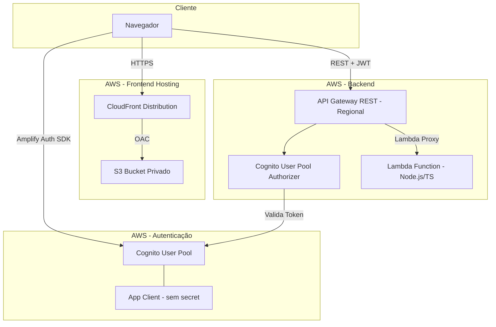
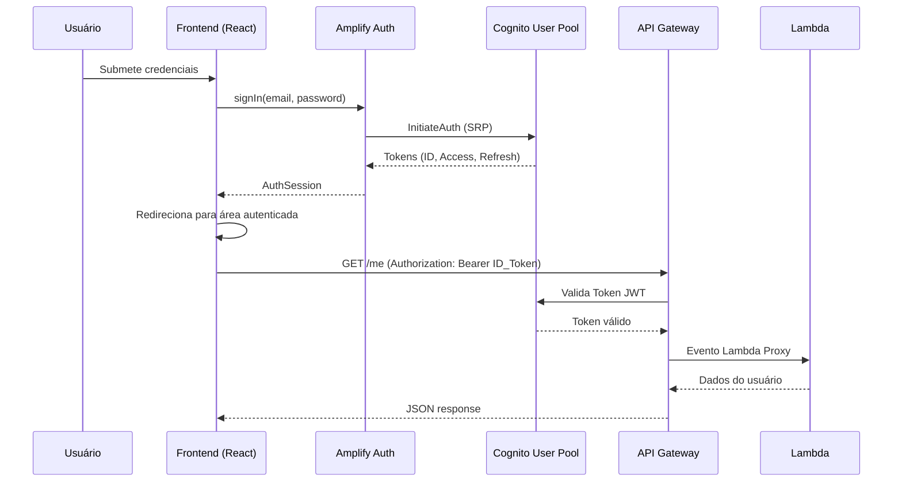
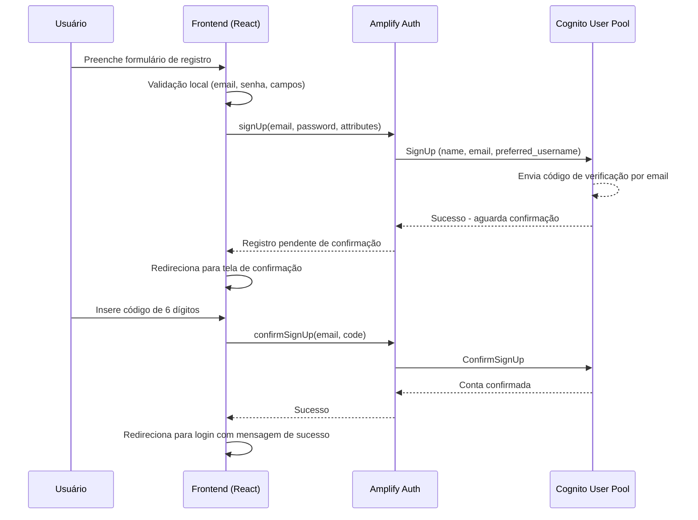

# Arquitetura do Projeto - Login Personalizado com Amazon Cognito

## Visão Geral da Arquitetura

Esta aplicação implementa um sistema de autenticação customizado utilizando Amazon Cognito, sem depender da Hosted UI ou Managed Login. A arquitetura segue o modelo serverless da AWS, com frontend React hospedado em S3/CloudFront, autenticação gerenciada pelo Cognito User Pool, e backend composto por API Gateway REST com Lambda monolítica.

A comunicação entre os componentes é feita via HTTPS, com tokens JWT (ID Token) emitidos pelo Cognito sendo utilizados para autorizar requisições à API.

---

## Componentes do Sistema

### Aplicação Frontend (React + TypeScript + Vite)

Aplicação single-page (SPA) construída com React 18, TypeScript e Vite como bundler. Responsável por toda a interface do usuário, incluindo telas de login, registro, confirmação de email, recuperação de senha, área autenticada e perfil. Utiliza CSS Modules para estilização com escopo local e React Router v6 para navegação client-side.

- **Build tool:** Vite (desenvolvimento rápido com HMR)
- **Linguagem:** TypeScript (tipagem estática)
- **Roteamento:** React Router v6 (rotas públicas e privadas)
- **Estado global:** React Context + useReducer (estado de autenticação)

### Serviço de Autenticação (AWS Amplify Auth v6)

Módulo que encapsula a comunicação com o Cognito User Pool utilizando a biblioteca oficial AWS Amplify Auth (v6). Gerencia automaticamente o armazenamento e renovação de tokens JWT, abstrai as chamadas SRP (Secure Remote Password) e expõe uma API simplificada para operações de autenticação.

- **Protocolo:** SRP (Secure Remote Password)
- **Tokens gerenciados:** ID Token, Access Token, Refresh Token
- **Armazenamento:** Mecanismo padrão do Amplify (sem acesso manual a cookies/localStorage)

### API Gateway REST (Regional, us-east-1)

API Gateway do tipo REST API, implantada como Regional na região us-east-1. Expõe endpoints para o backend e utiliza Cognito User Pool Authorizer para validar tokens JWT nas rotas protegidas. Configurada com integração Lambda Proxy e suporte a CORS.

- **Tipo:** REST API (Regional)
- **Stage:** dev
- **Autorização:** Cognito User Pool Authorizer
- **Integração:** Lambda Proxy (evento completo repassado à Lambda)
- **CORS:** Configurado para localhost:5173 e domínio CloudFront

### Função Lambda (Node.js + TypeScript, monolítica)

Função AWS Lambda única que processa todas as rotas da API. Implementada em Node.js com TypeScript, utiliza roteamento interno baseado no método HTTP e path do evento. Segue o princípio do menor privilégio nas permissões IAM.

- **Runtime:** Node.js (TypeScript compilado)
- **Padrão:** Monolítica (uma Lambda para todos os endpoints)
- **Endpoints:** GET /health, GET /me, GET /game/status
- **Segurança:** Logs sanitizados (sem dados sensíveis), respostas de erro genéricas

### Cognito User Pool (Gerenciamento de Usuários)

Serviço AWS que gerencia o ciclo de vida dos usuários: registro, verificação de email, autenticação, recuperação de senha e gerenciamento de atributos. Configurado com email como alias de login e política de senha rigorosa.

- **Região:** us-east-1
- **Login:** Email como alias
- **Verificação:** Código numérico por email
- **Atributos:** name, email, preferred_username
- **Política de senha:** Mínimo 8 caracteres, maiúscula, minúscula, número e caractere especial
- **App Client:** Sem client secret, fluxos ALLOW_USER_SRP_AUTH e ALLOW_REFRESH_TOKEN_AUTH

### Bucket S3 (Hospedagem Estática Privada)

Bucket S3 com todo acesso público bloqueado ("Block all public access"). Armazena os arquivos estáticos do frontend (HTML, CSS, JS, assets). Acessível exclusivamente através da distribuição CloudFront via Origin Access Control (OAC).

- **Acesso público:** Totalmente bloqueado
- **Bucket Policy:** Permite acesso apenas da distribuição CloudFront
- **Conteúdo:** Build de produção do Vite (dist/)

### Distribuição CloudFront (HTTPS, OAC)

CDN da AWS que serve o frontend via HTTPS com baixa latência. Utiliza Origin Access Control para acessar o bucket S3 de forma segura. Configurada com Custom Error Response para suportar roteamento client-side do React (SPA).

- **Protocolo:** Redirect HTTP to HTTPS
- **Acesso ao S3:** Origin Access Control (OAC)
- **Default Root Object:** index.html
- **Custom Error Response:** 403/404 → index.html (status 200) para suportar React Router
- **Domínio:** URL padrão do CloudFront (domínio customizado opcional)

---

## Diagrama de Arquitetura



### Descrição das Conexões

| Origem | Destino | Protocolo/Mecanismo | Descrição |
|--------|---------|---------------------|-----------|
| Navegador | CloudFront | HTTPS | Acesso à aplicação frontend |
| CloudFront | S3 | OAC (Origin Access Control) | Busca dos arquivos estáticos |
| Navegador | Cognito | Amplify Auth SDK (HTTPS) | Operações de autenticação (SRP) |
| Cognito | App Client | Interno | Configuração do cliente de aplicação |
| Navegador | API Gateway | REST + JWT (HTTPS) | Chamadas à API com token de autorização |
| API Gateway | Authorizer | Interno | Validação do token JWT |
| Authorizer | Cognito | Interno | Verificação de assinatura e expiração do token |
| API Gateway | Lambda | Lambda Proxy | Repasse do evento completo para processamento |

---

## Fluxo de Autenticação

O fluxo de autenticação utiliza o protocolo SRP (Secure Remote Password), que permite autenticar o usuário sem transmitir a senha em texto plano pela rede. O Amplify Auth abstrai toda a complexidade do SRP, expondo uma API simples de `signIn`.

### Etapas do Fluxo de Login

1. **Submissão de credenciais:** O usuário informa email e senha no formulário de login
2. **Chamada ao Amplify:** O frontend invoca `signIn(email, password)` do Amplify Auth
3. **Negociação SRP:** O Amplify executa o protocolo SRP com o Cognito (InitiateAuth + RespondToAuthChallenge)
4. **Emissão de tokens:** O Cognito retorna três tokens: ID Token, Access Token e Refresh Token
5. **Armazenamento de sessão:** O Amplify armazena os tokens de forma segura e retorna a sessão
6. **Redirecionamento:** O frontend redireciona o usuário para a área autenticada
7. **Chamada à API:** O frontend faz requisições à API incluindo o ID Token no header Authorization
8. **Validação:** O Cognito Authorizer da API Gateway valida a assinatura e expiração do token
9. **Processamento:** A Lambda recebe o evento com os claims do usuário e retorna os dados

### Diagrama de Sequência - Login



### Tokens JWT

| Token | Finalidade | Tempo de Vida |
|-------|-----------|---------------|
| ID Token | Identifica o usuário (claims: sub, email, name, preferred_username) | 1 hora (padrão Cognito) |
| Access Token | Autoriza operações no User Pool | 1 hora (padrão Cognito) |
| Refresh Token | Obtém novos tokens sem re-autenticação | 30 dias (padrão Cognito) |

---

## Decisões de Design

| Decisão | Escolha | Justificativa |
|---------|---------|---------------|
| Framework Frontend | React 18 + TypeScript + Vite | Performance de build com HMR, tipagem estática para segurança, ecossistema maduro com ampla comunidade |
| Biblioteca de Autenticação | AWS Amplify Auth v6 | Abstração oficial da AWS para Cognito, gerenciamento automático de tokens e renovação, suporte nativo a SRP |
| Roteamento | React Router v6 | Padrão de mercado para SPAs React, suporte robusto a rotas protegidas, lazy loading e navegação programática |
| Estilização | CSS Modules | Escopo local automático (evita conflitos), sem overhead de runtime (diferente de CSS-in-JS), compatibilidade nativa com Vite |
| Estado de Autenticação | React Context + useReducer | Simplicidade sem dependências externas (Redux não necessário), suficiente para estado global de autenticação |
| Backend | Lambda única (monolítica) | Simplicidade para apenas 3 endpoints, cold start compartilhado, deploy atômico, facilita manutenção neste estágio do projeto |
| Tipo de API | API Gateway REST (Regional) | Suporte nativo a Cognito User Pool Authorizer (sem código adicional), deploy por stages (dev/prod), integração direta com Lambda Proxy |
| Hospedagem Frontend | S3 privado + CloudFront + OAC | Segurança (sem acesso público direto ao bucket), HTTPS obrigatório, distribuição global com baixa latência, custo reduzido para conteúdo estático |

---

## Fluxo de Registro

O registro de um novo usuário segue um fluxo em duas etapas: criação da conta e confirmação do email via código de verificação.

### Etapas do Fluxo de Registro

1. **Preenchimento do formulário:** O usuário informa nome completo, apelido, email e senha
2. **Validação local:** O frontend valida formato do email, complexidade da senha e match das senhas
3. **Criação da conta:** O Amplify invoca `signUp` no Cognito com os atributos do usuário
4. **Envio do código:** O Cognito envia um código de verificação de 6 dígitos para o email informado
5. **Redirecionamento:** O frontend redireciona para a tela de confirmação de código
6. **Inserção do código:** O usuário digita o código recebido por email
7. **Confirmação:** O Amplify invoca `confirmSignUp` no Cognito para validar o código
8. **Ativação:** A conta é ativada e o usuário é redirecionado para o login com mensagem de sucesso

### Diagrama de Sequência - Registro



### Reenvio de Código

Caso o usuário não receba ou perca o código de verificação, a tela de confirmação oferece a opção "Reenviar código", que solicita ao Cognito o envio de um novo código para o email cadastrado.

---

## Estrutura de Diretórios

```
AWS-Cognito/
├── src/                          # Código-fonte do frontend
│   ├── components/               # Componentes reutilizáveis
│   │   ├── LoadingSpinner/       # Indicador de carregamento
│   │   ├── PasswordInput/        # Input com toggle de visibilidade
│   │   ├── PrivateRoute/         # Wrapper para rotas protegidas
│   │   ├── PublicRoute/          # Redirect para usuários autenticados
│   │   └── ErrorMessage/         # Exibição padronizada de erros
│   ├── pages/                    # Páginas da aplicação
│   │   ├── HomePage/             # Página inicial (tema dinossauro)
│   │   ├── LoginPage/            # Tela de login
│   │   ├── RegisterPage/         # Tela de registro
│   │   ├── ConfirmEmailPage/     # Confirmação de código
│   │   ├── ForgotPasswordPage/   # Recuperação de senha
│   │   ├── DashboardPage/        # Área autenticada
│   │   └── ProfilePage/          # Perfil do usuário
│   ├── routes/                   # Configuração de rotas
│   ├── services/                 # Serviços (auth, API)
│   ├── contexts/                 # React Contexts
│   ├── hooks/                    # Custom hooks
│   ├── utils/                    # Utilitários (validação, erros)
│   ├── styles/                   # Estilos globais
│   └── assets/                   # Imagens e assets
├── backend/                      # Código-fonte da Lambda
│   ├── src/
│   │   ├── index.ts              # Handler principal
│   │   ├── routes/               # Rotas (health, me, gameStatus)
│   │   ├── utils/                # Utilitários (CORS, response, logger)
│   │   └── types/                # Tipos TypeScript
│   ├── package.json
│   └── tsconfig.json
├── ARQUITETURA.md                # Este documento
├── IMPLANTACAO-AWS.md            # Guia de deploy na AWS
└── README.md                     # Documentação principal
```
