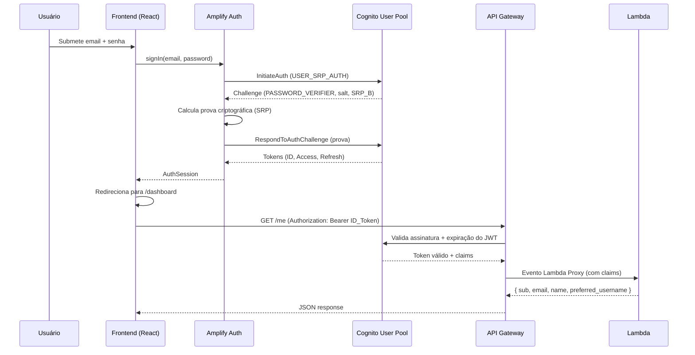
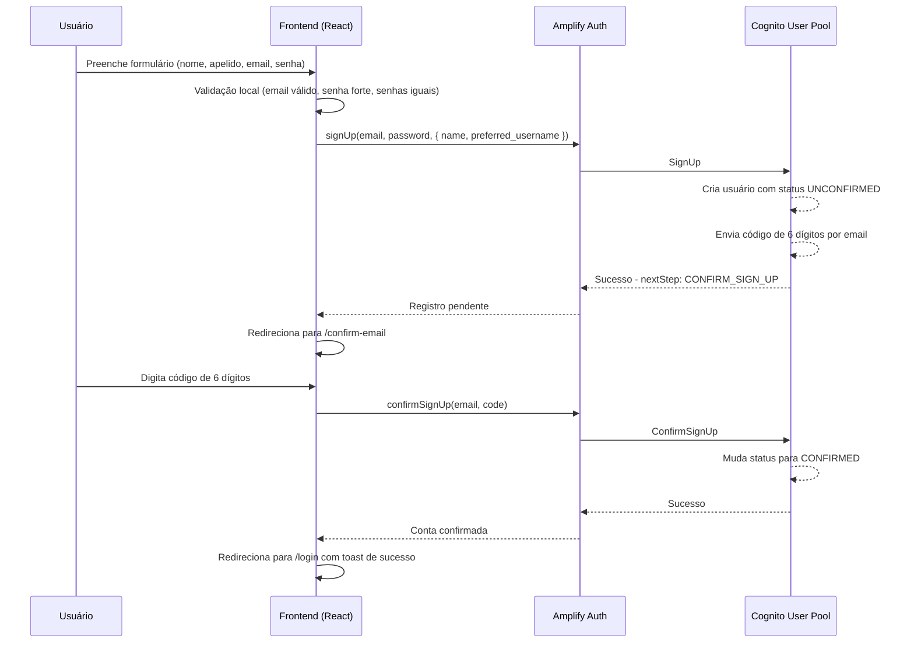
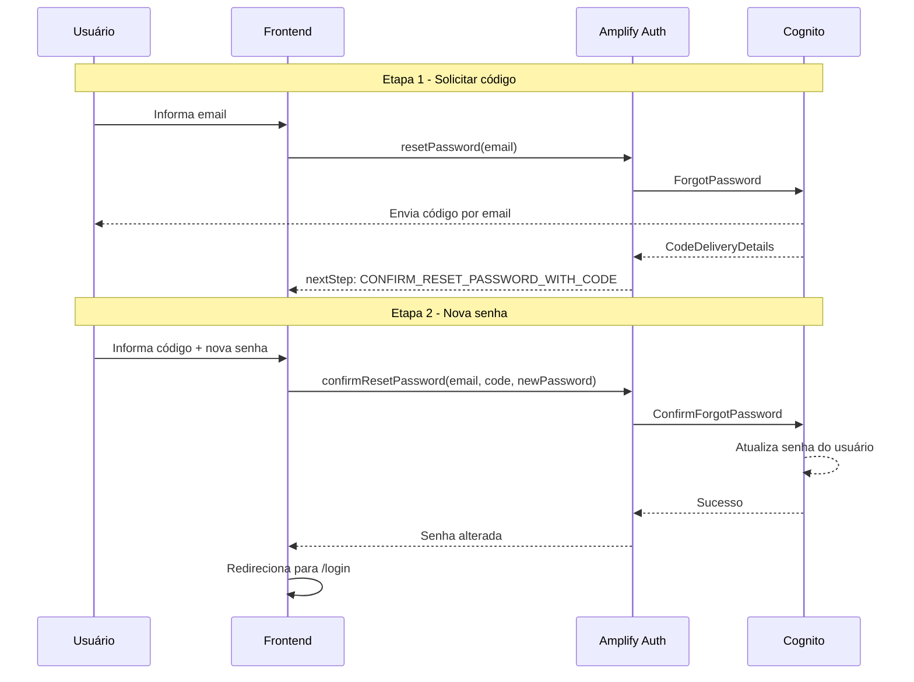

# Arquitetura Detalhada — Dino Login com Amazon Cognito

> Este documento complementa o [README.md](./README.md) com detalhes técnicos aprofundados: configurações específicas dos serviços, decisões de design justificadas e fluxos de sequência completos.

---

## Componentes do Sistema (Detalhamento Técnico)

### Aplicação Frontend (React + TypeScript + Vite)

Aplicação single-page (SPA) responsável por toda a interface do usuário. Detalhes de configuração:

- **Build tool:** Vite com HMR (Hot Module Replacement) para desenvolvimento rápido
- **Linguagem:** TypeScript com strict mode habilitado
- **Roteamento:** React Router v6 (rotas públicas via `PublicRoute` e protegidas via `PrivateRoute`)
- **Estado global:** React Context + useReducer para gerenciar estado de autenticação
- **Estilização:** CSS Modules com escopo local (sem conflitos de classe entre componentes)
- **Testes:** Vitest configurado com setup customizado (`src/test/setup.ts`)

### Serviço de Autenticação (AWS Amplify Auth v6)

Módulo `authService.ts` que encapsula a comunicação com o Cognito User Pool:

- **Protocolo:** SRP (Secure Remote Password) — a senha nunca trafega em texto plano
- **Tokens gerenciados:** ID Token, Access Token, Refresh Token
- **Armazenamento:** Mecanismo interno do Amplify (sem manipulação manual de cookies/localStorage)
- **Renovação:** Refresh Token usado automaticamente para renovar tokens expirados
- **Operações expostas:** signIn, signUp, confirmSignUp, signOut, resetPassword, confirmResetPassword, updatePassword, fetchUserAttributes, updateUserAttributes

### API Gateway REST (Regional, us-east-1)

- **Tipo:** REST API (Regional) — não é HTTP API
- **Stage:** `dev`
- **Autorização:** Cognito User Pool Authorizer (valida ID Token)
- **Integração:** Lambda Proxy (evento completo repassado, incluindo headers, body, pathParameters)
- **CORS:** Configurado para aceitar `localhost:5173` (dev) e domínio CloudFront (produção)
- **Rotas:**
  - `GET /health` — pública (sem authorizer)
  - `GET /me` — protegida (requer JWT)
  - `GET /game/status` — protegida (requer JWT)

### Função Lambda (Node.js + TypeScript, monolítica)

- **Runtime:** Node.js (TypeScript compilado para JS antes do deploy)
- **Padrão:** Monolítica — uma Lambda única com roteamento interno baseado em `httpMethod` + `path`
- **Permissões IAM:** Apenas CloudWatch Logs (princípio do menor privilégio)
- **Segurança:**
  - Logs sanitizados via `logger.ts` (mascara dados sensíveis)
  - Respostas de erro genéricas (sem stack traces expostos)
  - Validação de origens CORS via `cors.ts`
- **Deploy:** ZIP uploadado diretamente no console Lambda

### Cognito User Pool (Configuração)

- **Região:** us-east-1
- **Login:** Email como alias (não username)
- **Verificação:** Código numérico de 6 dígitos enviado por email
- **Atributos obrigatórios:** name, email
- **Atributos adicionais:** preferred_username
- **Política de senha:** Mínimo 8 caracteres, exige maiúscula, minúscula, número e caractere especial
- **App Client:** Sem client secret, fluxos habilitados: `ALLOW_USER_SRP_AUTH`, `ALLOW_REFRESH_TOKEN_AUTH`
- **Prevenção de enumeração:** Habilitada (não revela se email existe)

### Bucket S3 (Configuração)

- **Block all public access:** Habilitado (todas as 4 opções marcadas)
- **Bucket Policy:** Permite `s3:GetObject` apenas para o CloudFront via OAC
- **Conteúdo:** Pasta `dist/` gerada pelo `npm run build` do Vite
- **Versionamento:** Não habilitado (deploy substitui arquivos)

### Distribuição CloudFront (Configuração)

- **Viewer Protocol Policy:** Redirect HTTP to HTTPS
- **Origin Access:** Origin Access Control (OAC) — substitui o antigo OAI
- **Default Root Object:** `index.html`
- **Custom Error Responses:**
  - 403 → `/index.html` com status 200 (suporte ao React Router)
  - 404 → `/index.html` com status 200 (suporte ao React Router)
- **Cache:** Política padrão do CloudFront (TTL configurável)
- **Domínio:** URL padrão `dXXXXXX.cloudfront.net` (domínio customizado via Route 53 + ACM é opcional)

---

## Decisões de Design

| Decisão | Escolha | Justificativa |
|---------|---------|---------------|
| Framework Frontend | React 18 + TypeScript + Vite | Performance de build com HMR, tipagem estática para segurança, ecossistema maduro |
| Biblioteca de Auth | AWS Amplify Auth v6 | Abstração oficial da AWS para Cognito, gerenciamento automático de tokens, suporte nativo a SRP |
| Roteamento | React Router v6 | Padrão de mercado para SPAs React, suporte a rotas protegidas e lazy loading |
| Estilização | CSS Modules | Escopo local automático, sem overhead de runtime, compatibilidade nativa com Vite |
| Estado de Auth | React Context + useReducer | Suficiente para estado de autenticação sem complexidade de Redux |
| Backend | Lambda monolítica | Simplicidade para 3 endpoints, cold start compartilhado, deploy atômico |
| Tipo de API | API Gateway REST | Suporte nativo a Cognito Authorizer, deploy por stages, integração Lambda Proxy |
| Hospedagem Frontend | S3 privado + CloudFront + OAC | Segurança máxima, HTTPS obrigatório, CDN global com baixa latência |
| Testes | Vitest | Compatível nativamente com Vite, rápido, API similar ao Jest |

### Por que REST API ao invés de HTTP API?

O API Gateway oferece dois tipos: REST API e HTTP API. A escolha foi REST API porque:

1. **Cognito User Pool Authorizer nativo** — na REST API o authorizer valida o JWT sem código. Na HTTP API seria necessário usar JWT Authorizer com configuração manual
2. **Stages com deploy explícito** — permite ter `dev` e `prod` com controle de versão
3. **Custo:** para o volume deste projeto, a diferença de custo é insignificante

### Por que Lambda monolítica ao invés de uma por rota?

1. **Simplicidade** — apenas 3 endpoints, não justifica a complexidade de múltiplas Lambdas
2. **Cold start** — com uma Lambda só, uma vez "quente", atende todos os paths
3. **Deploy atômico** — um único ZIP garante consistência entre endpoints
4. **Refatoração futura** — se o projeto crescer, migrar para Lambda por rota é simples

---

## Fluxo de Autenticação (Detalhado)

### Login — Protocolo SRP passo a passo

O SRP (Secure Remote Password) garante que a senha nunca é transmitida pela rede:

1. **Submissão:** Usuário informa email + senha no formulário
2. **Amplify Auth:** Frontend invoca `signIn(email, password)`
3. **InitiateAuth:** Amplify envia `USER_SRP_AUTH` com o username para o Cognito
4. **Challenge:** Cognito retorna `PASSWORD_VERIFIER` challenge com salt e SRP_B
5. **RespondToAuthChallenge:** Amplify calcula a prova criptográfica localmente e responde
6. **Tokens emitidos:** Cognito valida e retorna ID Token, Access Token e Refresh Token
7. **Sessão salva:** Amplify armazena tokens internamente
8. **Redirecionamento:** Frontend redireciona para `/dashboard`



### Registro — Fluxo completo com confirmação



### Reenvio de Código

Se o usuário não recebeu o código:

1. Clica em "Reenviar código" na tela de confirmação
2. Frontend invoca `resendSignUpCode(email)` via Amplify
3. Cognito envia novo código de 6 dígitos
4. Código anterior é invalidado

### Recuperação de Senha (2 etapas)



---

## Comunicação Frontend ↔ API (Detalhes)

### Como o token é enviado

O `apiService.ts` implementa um cliente HTTP que:

1. Obtém o ID Token atual via `fetchAuthSession()` do Amplify
2. Adiciona o header `Authorization: Bearer <idToken>` em toda requisição
3. Se o token estiver expirado, o Amplify renova automaticamente via Refresh Token
4. Em caso de 401 (token inválido/expirado sem refresh), redireciona para login

### Validação pelo Cognito Authorizer

O Authorizer configurado no API Gateway:

1. Extrai o token do header `Authorization`
2. Verifica a assinatura usando as chaves públicas (JWKS) do User Pool
3. Verifica se `iss` corresponde ao User Pool correto
4. Verifica se `exp` (expiração) não passou
5. Verifica se `token_use` é `id` (ID Token)
6. Se válido, injeta os claims no `event.requestContext.authorizer.claims`

### Claims disponíveis na Lambda

Após validação, a Lambda recebe em `event.requestContext.authorizer.claims`:

```json
{
  "sub": "uuid-do-usuario",
  "email": "usuario@email.com",
  "name": "Nome Completo",
  "preferred_username": "apelido",
  "email_verified": "true",
  "iss": "https://cognito-idp.us-east-1.amazonaws.com/us-east-1_XXXXX",
  "aud": "app-client-id",
  "token_use": "id",
  "auth_time": "1234567890",
  "exp": "1234571490"
}
```

---

## Segurança — Detalhes Técnicos

### CORS (Cross-Origin Resource Sharing)

O backend (`cors.ts`) implementa validação de origens:

- **Origens permitidas:** `http://localhost:5173` (dev), URL do CloudFront (prod)
- **Headers permitidos:** Content-Type, Authorization
- **Métodos:** GET, POST, PUT, DELETE, OPTIONS
- **Preflight:** OPTIONS retorna headers CORS sem passar pelo Authorizer

### Sanitização de Logs

O `logger.ts` no backend mascara automaticamente:

- Tokens JWT (mostra apenas primeiros/últimos caracteres)
- Headers de Authorization
- Dados sensíveis do evento

### Respostas de Erro

A Lambda nunca expõe:
- Stack traces
- Mensagens internas de erro
- Nomes de variáveis ou paths internos

Erros retornam mensagens genéricas como `"Erro interno do servidor"` com status 500.

---

## Referências

- [README.md](./README.md) — Visão geral do projeto, infraestrutura e estrutura de diretórios
- [IMPLANTACAO-AWS.md](./IMPLANTACAO-AWS.md) — Guia passo a passo para deploy na AWS
