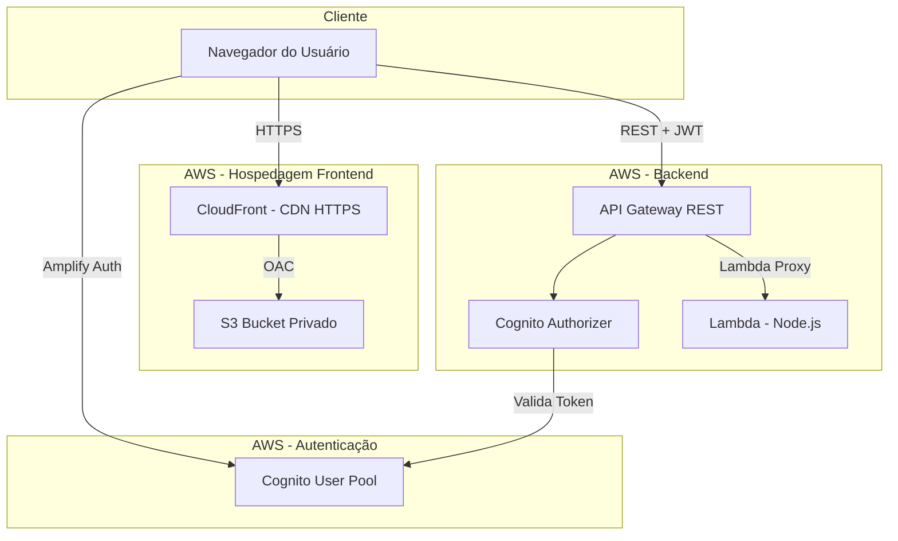
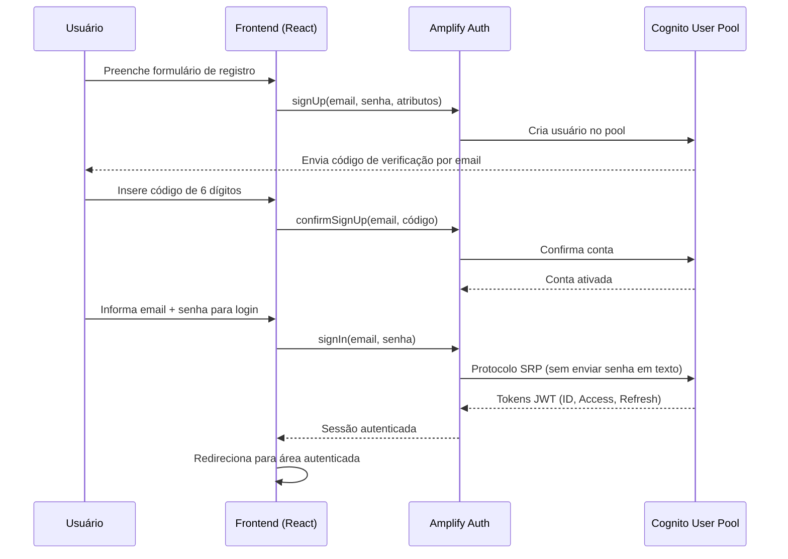

# 🦕 Dino Login — Autenticação Customizada com Amazon Cognito - Parte 1-3

## Descrição do Projeto

Este projeto é o **Projeto 1** de uma série de laboratórios práticos com serviços AWS. O objetivo é construir uma aplicação web com sistema de login totalmente customizado utilizando **Amazon Cognito**, sem depender da Hosted UI ou Managed Login da AWS.

A aplicação permite que usuários se cadastrem, confirmem o email, façam login, recuperem senha e gerenciem seu perfil — tudo através de telas React personalizadas que se comunicam diretamente com o Cognito via AWS Amplify.

### O que o Dino Login demonstra

- Registro de usuários com validação de email
- Login seguro com protocolo SRP (Secure Remote Password)
- Recuperação e alteração de senha
- Proteção de rotas e endpoints com tokens JWT
- Gerenciamento de perfil do usuário

---

## Diagrama de Arquitetura

A aplicação segue uma arquitetura **serverless** na AWS, onde não é necessário gerenciar servidores. Todos os componentes são serviços gerenciados que escalam automaticamente.



---

## Resumo da Infraestrutura

| Camada | Componente | Responsabilidade |
|--------|-----------|-----------------|
| **Frontend** | React 18 + TypeScript + Vite | Interface de usuário (SPA) |
| **Hospedagem** | S3 + CloudFront | Arquivos estáticos servidos via CDN com HTTPS |
| **Autenticação** | Amazon Cognito + Amplify Auth v6 | Gerenciamento de usuários e tokens JWT |
| **API** | API Gateway REST (Regional) | Exposição de endpoints com Cognito Authorizer |
| **Backend** | AWS Lambda (Node.js/TypeScript) | Processamento de requisições (serverless) |
| **DNS/SSL** | Route 53 + ACM | Domínio customizado com certificado HTTPS |

---

## Benefícios da Arquitetura

| Benefício | Descrição |
|-----------|-----------|
| **Sem servidor para gerenciar** | Todos os componentes são serverless — sem EC2, sem patches, sem manutenção de SO |
| **Escalabilidade automática** | Cognito, Lambda e API Gateway escalam conforme a demanda sem configuração |
| **Custo sob demanda** | Paga apenas pelo que usa — ideal para projetos com tráfego variável |
| **Segurança integrada** | HTTPS obrigatório, tokens JWT com expiração, bucket privado, Origin Access Control |
| **Alta disponibilidade** | Serviços distribuídos em múltiplas zonas de disponibilidade automaticamente |
| **Separação de responsabilidades** | Frontend (S3/CloudFront) e backend (Lambda/API Gateway) são independentes |
| **Deploy simples** | Frontend: upload para S3. Backend: upload de ZIP para Lambda. Sem CI/CD complexo |
| **Sem banco de dados** | Os dados dos usuários ficam no Cognito. A Lambda é stateless |

---

## Recursos AWS Utilizados

| Recurso | Função |
|---------|--------|
| **Amazon Cognito** | Gerencia usuários, registro, login, tokens JWT, recuperação de senha |
| **AWS Lambda** | Backend serverless que processa as requisições da API |
| **API Gateway (REST)** | Expõe endpoints HTTP e valida tokens com Cognito Authorizer |
| **Amazon S3** | Armazena os arquivos estáticos do frontend (HTML, CSS, JS) |
| **Amazon CloudFront** | CDN que serve o frontend via HTTPS com baixa latência |
| **AWS Certificate Manager (ACM)** | Gerencia certificado SSL para HTTPS no domínio customizado |
| **Amazon Route 53** | DNS para resolver o domínio customizado para o CloudFront |
| **AWS IAM** | Permissões mínimas para a Lambda (princípio do menor privilégio) |

---

## Acesso dos Usuários

O usuário acessa a aplicação através de um navegador web. O fluxo de acesso inclui:

1. O usuário acessa a URL da aplicação (ex: `https://dino.dev.seudominio.com`)
2. O frontend carrega via CloudFront (CDN) com HTTPS
3. Para se autenticar, o frontend se comunica diretamente com o Cognito via Amplify Auth
4. Após login, o frontend obtém tokens JWT para acessar a API protegida
5. A API Gateway valida o token automaticamente antes de repassar à Lambda

### Fluxo de Cadastro e Login



---

## DNS e Segurança

### Domínio e HTTPS

1. O DNS (**Route 53**) resolve o domínio para a distribuição **CloudFront**
2. O CloudFront serve os arquivos estáticos do **S3** via HTTPS
3. O certificado SSL é gerenciado pelo **ACM** (AWS Certificate Manager)
4. O bucket S3 é **privado** — ninguém acessa diretamente, só o CloudFront via Origin Access Control (OAC)

### Proteção da API

- Todas as rotas protegidas exigem um token JWT válido no header `Authorization`
- O **Cognito User Pool Authorizer** valida automaticamente a assinatura e expiração do token
- A Lambda recebe apenas os claims do usuário (sub, email, name, preferred_username), sem acesso direto ao Cognito

### Tokens JWT

| Token | Finalidade | Tempo de Vida |
|-------|-----------|---------------|
| ID Token | Identifica o usuário (claims: sub, email, name, preferred_username) | 1 hora |
| Access Token | Autoriza operações no User Pool | 1 hora |
| Refresh Token | Obtém novos tokens sem re-autenticação | 30 dias |

---

## Balanceamento de Carga

Esta aplicação **não utiliza** um balanceador de carga tradicional (como ALB ou NLB), pois toda a arquitetura é serverless:

- O **CloudFront** atua como ponto de entrada global, distribuindo o conteúdo estático através de edge locations com baixa latência
- O **API Gateway** gerencia automaticamente a distribuição de requisições para a Lambda, com throttling e rate limiting configuráveis
- O **Lambda** escala horizontalmente de forma automática, criando novas instâncias conforme a demanda

Não há necessidade de Load Balancer porque cada componente já possui sua própria estratégia de escalabilidade gerenciada pela AWS.

---

## Computação e Escalabilidade

### Frontend

- **Hospedagem estática** no S3 — sem computação no lado do servidor para servir HTML/CSS/JS
- **CloudFront CDN** — cache em edge locations globais, reduz latência e carga no S3
- Escalabilidade é ilimitada para conteúdo estático

### Backend

- **AWS Lambda** (Node.js + TypeScript) — função única (monolítica) para todos os endpoints
- **Cold start compartilhado** — como é uma Lambda só, uma vez "quente" atende todos os paths
- **Escalabilidade automática** — Lambda cria instâncias conforme requisições simultâneas
- **Concorrência** — limite padrão de 1000 execuções simultâneas por região (ajustável)

### Autenticação

- **Amazon Cognito** — escalabilidade gerenciada pela AWS, sem limites práticos para aplicações comuns
- **Throttling** — Cognito aplica limites de taxa para proteção contra abuso (configurável via Support)

---

## Fluxo do Processamento

### Requisição de conteúdo estático (Frontend)

```
Navegador → DNS (Route 53) → CloudFront → S3 (arquivos do build)
```

### Requisição autenticada à API

```
Navegador → API Gateway → Cognito Authorizer (valida JWT) → Lambda → Resposta JSON
```

### Detalhamento de uma chamada à API

1. O frontend pega o **ID Token** (JWT) da sessão do Cognito
2. Envia a requisição para o API Gateway com `Authorization: Bearer <token>`
3. O **Cognito Authorizer** valida:
   - Se o token foi assinado pelo Cognito correto
   - Se o token não está expirado
4. Se válido, o API Gateway repassa o evento para a Lambda com os **claims** do usuário
5. A Lambda roteia internamente (`/health`, `/me`, `/game/status`) e retorna JSON
6. A resposta volta pelo API Gateway até o navegador

---

## Conceitos Demonstrados

Este projeto demonstra na prática os seguintes conceitos:

- **Amazon Cognito** — gerenciamento de usuários sem banco de dados próprio
- **AWS Amplify Auth v6** — autenticação frontend direta com Cognito
- **Cognito User Pool Authorizer** — proteção de endpoints no API Gateway com tokens JWT
- **S3 + CloudFront + HTTPS** — hospedagem segura de aplicação estática
- **CORS** — comunicação segura entre frontend e backend em domínios diferentes
- **Lambda Serverless** — backend sem servidor com deploy atômico
- **Domínio customizado com SSL** — ACM + Route 53 para HTTPS no domínio próprio
- **Protocolo SRP** — autenticação segura sem transmitir senha em texto plano
- **Origin Access Control (OAC)** — acesso ao S3 exclusivamente via CloudFront
- **IAM com menor privilégio** — permissões mínimas necessárias para a Lambda

---

## Estrutura de Diretórios

```
Amazon-Cognito/
├── src/                          # Código-fonte do frontend (React)
│   ├── components/               # Componentes reutilizáveis da interface
│   │   ├── ErrorMessage/         # Exibição padronizada de erros
│   │   ├── LoadingSpinner/       # Indicador de carregamento
│   │   ├── PasswordInput/        # Campo de senha com toggle de visibilidade
│   │   ├── PrivateRoute/         # Protege rotas que exigem login
│   │   └── PublicRoute/          # Redireciona logados para o dashboard
│   ├── pages/                    # Páginas completas da aplicação
│   │   ├── HomePage/             # Página inicial (tema dinossauro)
│   │   ├── LoginPage/            # Tela de login
│   │   ├── RegisterPage/         # Tela de cadastro
│   │   ├── ConfirmEmailPage/     # Confirmação do código de email
│   │   ├── ForgotPasswordPage/   # Recuperação de senha (2 etapas)
│   │   ├── DashboardPage/        # Área autenticada principal
│   │   └── ProfilePage/          # Edição de perfil e senha
│   ├── routes/                   # Configuração de rotas (React Router)
│   │   └── AppRouter.tsx         # Define rotas públicas e privadas
│   ├── services/                 # Comunicação com serviços externos
│   │   ├── authService.ts        # Wrapper sobre Amplify Auth (signIn, signUp, etc.)
│   │   └── apiService.ts         # Cliente HTTP para API Gateway (com JWT)
│   ├── contexts/                 # Estado global da aplicação
│   │   └── AuthContext.tsx       # Gerencia estado de autenticação
│   ├── hooks/                    # Hooks customizados do React
│   │   ├── useAuth.ts            # Acessa o contexto de autenticação
│   │   └── useForm.ts            # Gerencia formulários com validação
│   ├── utils/                    # Funções utilitárias
│   │   ├── validators.ts         # Validação de email, senha, campos
│   │   └── errorMapper.ts        # Traduz erros do Cognito para português
│   ├── types/                    # Interfaces e tipos TypeScript
│   │   └── index.ts              # AuthState, UserProfile, etc.
│   ├── styles/                   # Estilos globais
│   │   └── global.css            # Variáveis CSS, reset, tema dinossauro
│   ├── test/                     # Configuração de testes
│   │   └── setup.ts              # Setup do Vitest
│   ├── App.tsx                   # Componente raiz (AuthProvider + Router)
│   └── main.tsx                  # Entry point (configura Amplify)
├── backend/                      # Código-fonte do backend (Lambda)
│   ├── src/
│   │   ├── index.ts              # Handler principal (roteamento)
│   │   ├── routes/               # Handlers de cada endpoint
│   │   │   ├── health.ts         # GET /health (público)
│   │   │   ├── me.ts             # GET /me (protegido - dados do usuário)
│   │   │   └── gameStatus.ts     # GET /game/status (protegido)
│   │   ├── utils/                # Utilitários do backend
│   │   │   ├── cors.ts           # Validação de origens CORS
│   │   │   ├── response.ts       # Builder de respostas Lambda Proxy
│   │   │   └── logger.ts         # Log seguro (mascara dados sensíveis)
│   │   └── types/
│   │       └── index.ts          # Tipos do backend
│   ├── package.json
│   └── tsconfig.json
├── public/                       # Arquivos públicos do Vite
├── Imagens/                      # Screenshots e referências visuais
├── .gitignore                    # Ignora node_modules, .env, dist
├── index.html                    # HTML principal do Vite
├── package.json                  # Dependências do frontend
├── vite.config.ts                # Configuração do Vite (build/dev)
├── vitest.config.ts              # Configuração do Vitest (testes)
├── tsconfig.json                 # Configuração base do TypeScript
├── tsconfig.app.json             # TypeScript config para a aplicação
├── tsconfig.node.json            # TypeScript config para scripts Node
├── README.md                     # Este arquivo
├── ARQUITETURA.md                # Detalhes técnicos e diagramas
└── IMPLANTACAO-AWS.md            # Guia passo a passo de implantação na AWS
```

---

## Documentação Adicional

- [IMPLANTACAO-AWS.md](./IMPLANTACAO-AWS.md) — Guia completo de implantação na AWS (Cognito, Lambda, API Gateway, S3, CloudFront, domínio customizado)
- [ARQUITETURA.md](./ARQUITETURA.md) — Detalhes técnicos, decisões de design e diagramas de sequência
