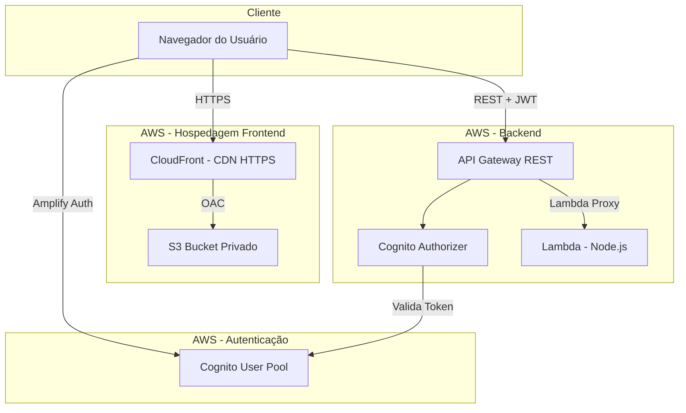
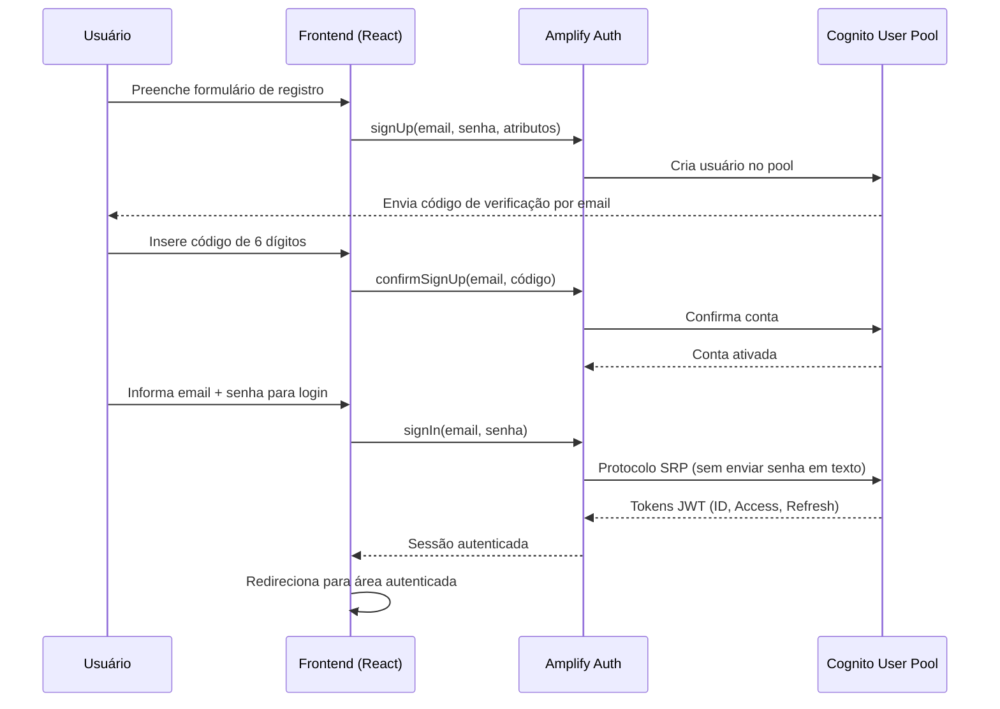

# 🦕 Dino Login — Autenticação Customizada com Amazon Cognito

## Sobre o Projeto

Este projeto é o **Projeto 1** de uma série de laboratórios práticos com serviços AWS. O objetivo é construir uma aplicação web com sistema de login totalmente customizado utilizando **Amazon Cognito**, sem depender da Hosted UI ou Managed Login da AWS.

A aplicação permite que usuários se cadastrem, confirmem o email, façam login, recuperem senha e gerenciem seu perfil — tudo através de telas React personalizadas que se comunicam diretamente com o Cognito via AWS Amplify.

## Para que serve?

O Dino Login demonstra como implementar um fluxo completo de autenticação e autorização em uma aplicação web moderna utilizando serviços gerenciados da AWS. Isso inclui:

- Registro de usuários com validação de email
- Login seguro com protocolo SRP (Secure Remote Password)
- Recuperação e alteração de senha
- Proteção de rotas e endpoints com tokens JWT
- Gerenciamento de perfil do usuário

## O que aprendemos com este projeto?

- Como configurar e utilizar o **Amazon Cognito** para gerenciar usuários sem precisar de um banco de dados próprio
- Como construir um frontend React que se autentica diretamente com o Cognito via **AWS Amplify Auth v6**
- Como proteger endpoints de API com **Cognito User Pool Authorizer** no API Gateway
- Como hospedar uma aplicação estática de forma segura com **S3 + CloudFront + HTTPS**
- Como configurar **CORS** e comunicação segura entre frontend e backend
- Como usar **Lambda** como backend serverless
- Como configurar **domínio customizado com certificado SSL** (ACM + Route 53)

---

## Arquitetura AWS

### Visão geral

A aplicação segue uma arquitetura **serverless** na AWS, onde não é necessário gerenciar servidores. Todos os componentes são serviços gerenciados que escalam automaticamente.



### Acesso e DNS (HTTPS)

O acesso do usuário à aplicação funciona da seguinte forma:

1. O usuário acessa a URL (ex: `https://dino.dev.seudominio.com`)
2. O DNS (Route 53) resolve o domínio para a distribuição **CloudFront**
3. O CloudFront serve os arquivos estáticos do **S3** via HTTPS
4. O certificado SSL é gerenciado pelo **ACM** (AWS Certificate Manager)
5. O bucket S3 é **privado** — ninguém acessa diretamente, só o CloudFront via Origin Access Control (OAC)

Isso garante que toda a comunicação é criptografada e o conteúdo é entregue com baixa latência globalmente.

---

## Amazon Cognito — Como funciona a autenticação

O Amazon Cognito é o serviço que gerencia todo o ciclo de vida dos usuários: registro, verificação, login, tokens e recuperação de senha.

### Fluxo do cadastro e login



### Como a API é protegida

Quando o usuário está logado e a aplicação chama a API:

1. O frontend pega o **ID Token** (JWT) da sessão do Cognito
2. Envia a requisição para o API Gateway com o header `Authorization: Bearer <token>`
3. O **Cognito Authorizer** no API Gateway valida automaticamente:
   - Se o token foi assinado pelo Cognito correto
   - Se o token não está expirado
4. Se válido, o API Gateway repassa a requisição para a Lambda com os **claims** do usuário (sub, email, name, preferred_username)
5. A Lambda retorna os dados do usuário sem precisar consultar banco de dados

---

## Aplicação Node.js — Como funciona o site

### Frontend (React + TypeScript + Vite)

O frontend é uma Single Page Application (SPA) construída com:

- **React 18** — interface de usuário com componentes reutilizáveis
- **TypeScript** — tipagem estática para maior segurança no código
- **Vite** — bundler rápido para desenvolvimento e build de produção
- **AWS Amplify Auth v6** — biblioteca oficial para comunicação com Cognito
- **React Router v6** — navegação entre páginas sem recarregar
- **CSS Modules** — estilização com escopo local (sem conflitos de CSS)

O frontend NÃO acessa banco de dados. Toda a autenticação é feita diretamente com o Cognito através do Amplify, e os dados do usuário vêm da API Gateway + Lambda.

### Backend (Lambda + TypeScript)

O backend é uma **única função Lambda** que processa todas as requisições da API. Funciona assim:

- Recebe o evento do API Gateway (método HTTP + path + headers)
- Roteia internamente: `/health`, `/me`, `/game/status`
- Para `/me`, extrai os claims do token JWT (já validado pelo Authorizer)
- Retorna resposta JSON com headers CORS

Não usa banco de dados — os dados do usuário vêm dos claims do JWT emitido pelo Cognito.

### Fluxo de processamento de uma requisição

```
Navegador → CloudFront → S3 (frontend estático)
                              ↓
                     Usuário interage
                              ↓
Navegador → API Gateway → Cognito Authorizer → Lambda → Resposta JSON
                              ↓
                     Valida JWT com Cognito
```

---

## Recursos AWS utilizados

| Recurso | Função |
|---------|--------|
| **Amazon Cognito** | Gerencia usuários, registro, login, tokens JWT, recuperação de senha |
| **AWS Lambda** | Backend serverless que processa as requisições da API |
| **API Gateway (REST)** | Expõe endpoints HTTP e valida tokens com Cognito Authorizer |
| **Amazon S3** | Armazena os arquivos estáticos do frontend (HTML, CSS, JS) |
| **Amazon CloudFront** | CDN que serve o frontend via HTTPS com baixa latência |
| **AWS Certificate Manager (ACM)** | Gerencia certificado SSL para HTTPS no domínio customizado |
| **Amazon Route 53** | DNS para resolver o domínio customizado para o CloudFront |
| **AWS IAM** | Permissões mínimas para a Lambda (princípio do menor privilégio) |

---

## Benefícios da arquitetura

| Benefício | Descrição |
|-----------|-----------|
| **Sem servidor para gerenciar** | Todos os componentes são serverless — sem EC2, sem patches, sem manutenção de SO |
| **Escalabilidade automática** | Cognito, Lambda e API Gateway escalam conforme a demanda sem configuração |
| **Custo sob demanda** | Paga apenas pelo que usa — ideal para projetos com tráfego variável |
| **Segurança integrada** | HTTPS obrigatório, tokens JWT com expiração, bucket privado, Origin Access Control |
| **Alta disponibilidade** | Serviços distribuídos em múltiplas zonas de disponibilidade automaticamente |
| **Separação de responsabilidades** | Frontend (S3/CloudFront) e backend (Lambda/API Gateway) são independentes |
| **Deploy simples** | Frontend: upload para S3. Backend: upload de ZIP para Lambda. Sem CI/CD complexo |
| **Sem banco de dados** | Os dados dos usuários ficam no Cognito. A Lambda é stateless |

---

## Estrutura de Diretórios

```
AWS-Cognito/
├── src/                          # Código-fonte do frontend (React)
│   ├── components/               # Componentes reutilizáveis da interface
│   │   ├── LoadingSpinner/       # Indicador de carregamento
│   │   ├── PasswordInput/        # Campo de senha com toggle de visibilidade
│   │   ├── PrivateRoute/         # Protege rotas que exigem login
│   │   ├── PublicRoute/          # Redireciona logados para o dashboard
│   │   └── ErrorMessage/         # Exibição padronizada de erros
│   ├── pages/                    # Páginas completas da aplicação
│   │   ├── HomePage/             # Página inicial (tema dinossauro)
│   │   ├── LoginPage/            # Tela de login
│   │   ├── RegisterPage/         # Tela de cadastro
│   │   ├── ConfirmEmailPage/     # Confirmação do código de email
│   │   ├── ForgotPasswordPage/   # Recuperação de senha (2 etapas)
│   │   ├── DashboardPage/        # Área autenticada principal
│   │   └── ProfilePage/          # Edição de perfil e senha
│   ├── routes/                   # Configuração de rotas (React Router)
│   │   └── AppRouter.tsx         # Define rotas públicas e privadas
│   ├── services/                 # Comunicação com serviços externos
│   │   ├── authService.ts        # Wrapper sobre Amplify Auth (signIn, signUp, etc.)
│   │   └── apiService.ts         # Cliente HTTP para API Gateway (com JWT)
│   ├── contexts/                 # Estado global da aplicação
│   │   └── AuthContext.tsx       # Gerencia estado de autenticação
│   ├── hooks/                    # Hooks customizados do React
│   │   ├── useAuth.ts            # Acessa o contexto de autenticação
│   │   └── useForm.ts            # Gerencia formulários com validação
│   ├── utils/                    # Funções utilitárias
│   │   ├── validators.ts         # Validação de email, senha, campos
│   │   └── errorMapper.ts        # Traduz erros do Cognito para português
│   ├── types/                    # Interfaces e tipos TypeScript
│   │   └── index.ts              # AuthState, UserProfile, etc.
│   ├── styles/                   # Estilos globais
│   │   └── global.css            # Variáveis CSS, reset, tema dinossauro
│   ├── App.tsx                   # Componente raiz (AuthProvider + Router)
│   └── main.tsx                  # Entry point (configura Amplify)
├── backend/                      # Código-fonte do backend (Lambda)
│   ├── src/
│   │   ├── index.ts              # Handler principal (roteamento)
│   │   ├── routes/               # Handlers de cada endpoint
│   │   │   ├── health.ts         # GET /health (público)
│   │   │   ├── me.ts             # GET /me (protegido - dados do usuário)
│   │   │   └── gameStatus.ts     # GET /game/status (protegido)
│   │   ├── utils/                # Utilitários do backend
│   │   │   ├── cors.ts           # Validação de origens CORS
│   │   │   ├── response.ts       # Builder de respostas Lambda Proxy
│   │   │   └── logger.ts         # Log seguro (mascara dados sensíveis)
│   │   └── types/
│   │       └── index.ts          # Tipos do backend
│   ├── package.json
│   └── tsconfig.json
├── dist/                         # Build do frontend (gerado por npm run build)
├── public/                       # Arquivos públicos do Vite
├── .env                          # Variáveis de ambiente (NÃO commitar)
├── .env.example                  # Template de variáveis (sem valores reais)
├── .gitignore                    # Ignora node_modules, .env, dist
├── index.html                    # HTML principal do Vite
├── package.json                  # Dependências do frontend
├── vite.config.ts                # Configuração do Vite (build/dev)
├── vitest.config.ts              # Configuração do Vitest (testes)
├── README.md                     # Este arquivo
├── ARQUITETURA.md                # Detalhes técnicos e diagramas
└── IMPLANTACAO-AWS.md            # Guia passo a passo de implantação na AWS
```

---

## Documentação Adicional

- [IMPLANTACAO-AWS.md](./IMPLANTACAO-AWS.md) — Guia completo de implantação na AWS (Cognito, Lambda, API Gateway, S3, CloudFront, domínio customizado)
- [ARQUITETURA.md](./ARQUITETURA.md) — Detalhes técnicos, decisões de design e diagramas de sequência
